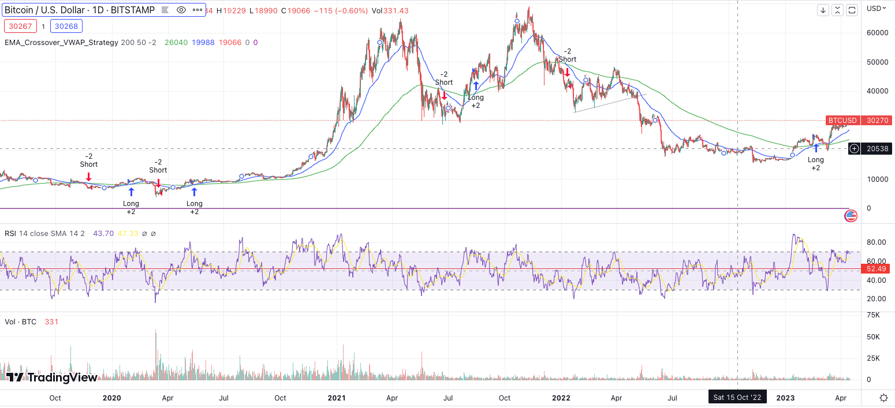
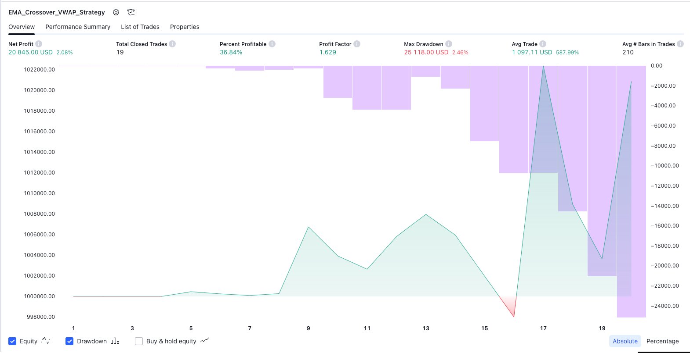
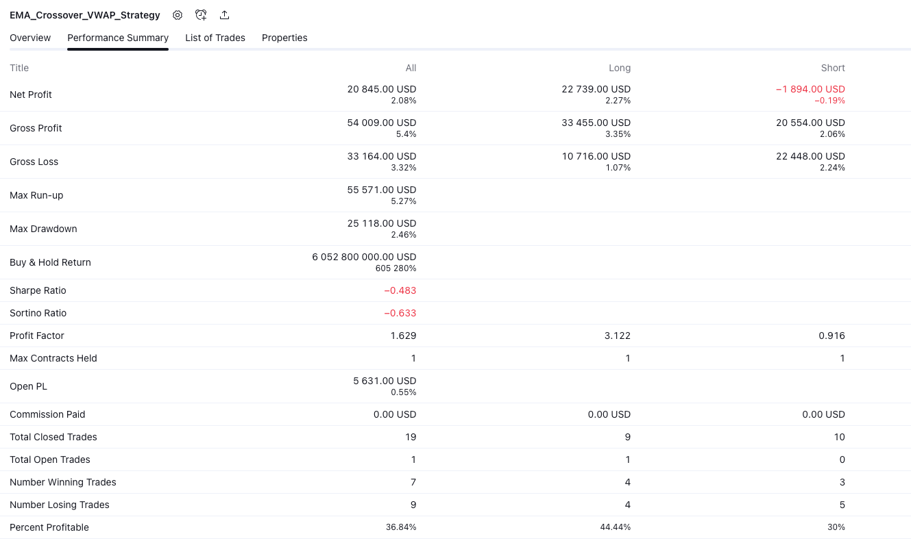

# Enhanced Moving Averages Crossover Strategy with VWAP

This is a simple trading strategy that uses a combination of moving averages and the Volume Weighted Average Price (VWAP) indicator to generate buy and sell signals. The strategy is designed to enhance the accuracy of the standard moving average crossover strategy by filtering out false signals using the VWAP and Percentage Price Oscillator (PPO) indicators.

## Theory

The moving average crossover strategy is a widely used trading strategy that involves the use of two or more moving averages to generate buy and sell signals. The basic idea is that when a short-term moving average crosses above a long-term moving average, it signals a buy signal, and when the short-term moving average crosses below the long-term moving average, it signals a sell signal.

However, the moving average crossover strategy can be prone to false signals, especially in volatile markets. The VWAP indicator, on the other hand, takes into account both the price and the volume of an asset and provides a more accurate measure of the true value of an asset. By using the VWAP indicator to filter the moving average crossover signals, we can improve the accuracy of the strategy and reduce false signals.

## Usage

To use the Enhanced Moving Averages Crossover Strategy with VWAP, follow these steps:

1. Open the Pine Editor in TradingView and create a new script.
2. Copy and paste [the code](pine-script) from this repository into the Pine Editor.
3. Click the "Add to Chart" button to add the strategy to your chart.
4. Use the input parameters to adjust the lengths of the Exponential Moving Averages (EMAs) and the VWAP threshold to suit your trading style.
5. Backtest the strategy using the Strategy Tester to see how it performs on historical data.

## Parameters

- `src`: The source price used for the moving averages. Default is `close`.
- `lengthEMA200`: The length of the 200-period Exponential Moving Average (EMA). Default is `200`.
- `lengthEMA50`: The length of the 50-period Exponential Moving Average (EMA). Default is `50`.
- `vwapThreshold`: The threshold used to filter the VWAP signals. A negative value indicates that the price is below the VWAP, while a positive value indicates that the price is above the VWAP. Default is `-0.02`.

## Notes

- The strategy works only with negative VWAP threshold values, as we're looking for situations where the price is below the VWAP. A positive threshold would look for situations where the price is above the VWAP.
- In the case of Bitcoin (BTCUSD), the strategy works well with both the 4-hour and daily timeframes. However, you may need to adjust the VWAP threshold parameter to suit the volatility of the market.
- This strategy is for educational purposes only and should not be used for real trading without proper testing and risk management. There is always the risk of false positives with any trading strategy, including this one.

## Example

### Strategy Tester Overview

### Strategy Tester Summary

